# RISC-V超流水线处理器

RV32IM+Zicsr 七级流水线 RISC-V CPU，标量单发、双位宽取指 + 宏操作融合，190MHz 时序零违例收敛于 Xilinx Kintex-7 XC7K325T-FFG900-2。

> 第十届全国大学生集成电路创新创业大赛（竞业达杯）分赛区决赛作品，队伍编号 CICC1001161。

---

## 快速预览

| 指标 | 数值 |
|------|------|
| **指令集** | RV32I 37 条 + M 扩展 8 条 + Zicsr 6 条 = 51 条 |
| **流水线** | 7 级，标量单发，级间寄存器 5 排 |
| **取指带宽** | 2 条/拍（供宏操作融合） |
| **CPI** | 矩阵乘法实测 1.078 |
| **时序** | 190MHz 零违例；频率提升 42%（270MHz）测评程序仍正常运行 |
| **综合资源** | LUT 5398 / FF 3077 / DSP 4（XC7K325T-2） |
| **矩阵乘法** | 1294ms @ 270MHz（数字孪生平台实测） |

---

## 架构总览

### 板级框架

SoC 由处理器核、指令/数据存储器、外设桥三部分组成，哈佛结构，IROM 双例化。论文图1给出完整的层次关系：

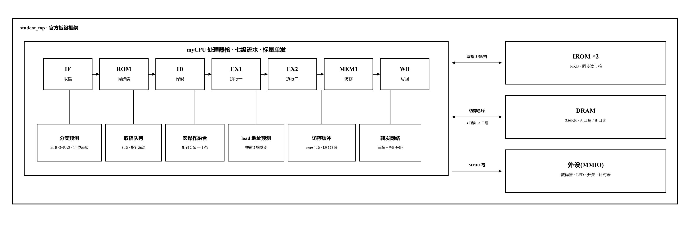

### 七级流水线

流水线分七级：**IF**（取指）→ **ROM**（IROM 同步读返回）→ **ID**（译码）→ **EX1**（执行一）→ **EX2**（执行二）→ **MEM1**（访存）→ **WB**（写回）。

取指前端自成回路（PC+BTB → IROM → 环形队列），不依赖后级；执行后端由转发网络和冲刷控制串起。级间寄存器 5 排，行为统一为四档优先级：`rst > flush > stall > 正常锁存`。flush 仅前 3 排——分支在 EX2 判决，MEM1/WB 中的指令在程序序上早于分支，无需冲刷。

### 流水级职责

| 流水级 | 职责 |
|--------|------|
| **IF** | pc_reg 输出取指地址，BTB 当拍查表决定下一地址，取指自成回路 |
| **ROM** | IROM 同步读返回（1 拍），指令 + 预测信息入取指队列 |
| **ID** | 队头出队 → ctrl 译码 + regfile 读 + imm_gen + 转发码预计算 + load 地址预测 |
| **EX1** | 转发 MUX（A/B 口各 5 选 1）→ ALU / 分支比较 / 乘法第 1 拍 / 预查 store 缓冲与 L0 |
| **EX2** | 分支判决与预测验证（控制枢纽），predict_wrong 当拍冲刷改向；乘法第 2 拍 |
| **MEM1** | DRAM 读写、store 缓冲维护、乘法第 3 拍结果合成 |
| **WB** | wb_data 三选一写回 regfile，L0 填充 |

### 数据通路总图

七级流水线全部模块、多路选择器、转发路径与级间寄存器（梯形=MUX，缺口多边形=ALU/加法器，细高矩形=级间寄存器，虚线=控制信号）：

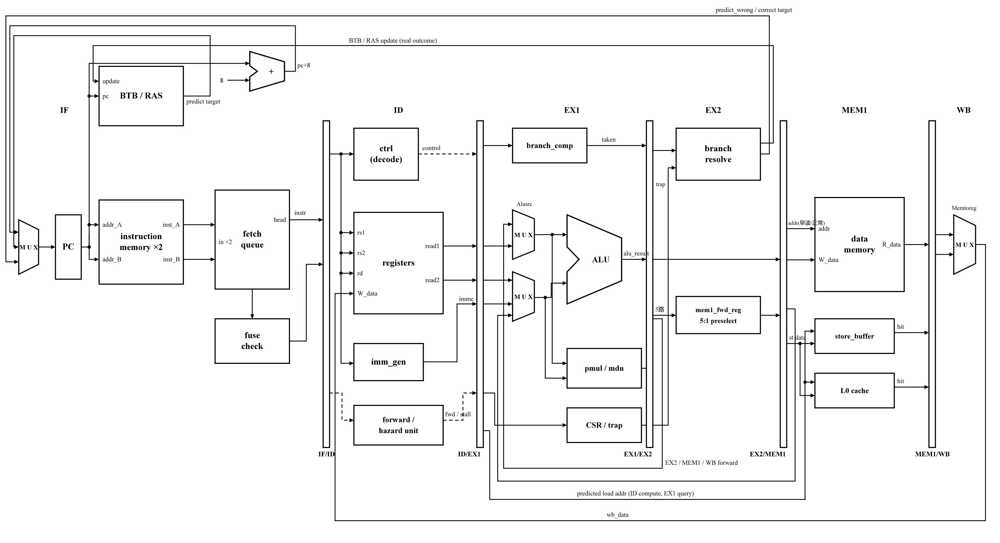

### 地址空间

| 区间 | 大小 | 用途 |
|------|------|------|
| `0x8000_0000 ~ 0x8000_3FFF` | 16KB | 指令存储器 IROM（BRAM IP 双例化，A/B 两口各 1 份，内容相同） |
| `0x8010_0000 ~ 0x8013_FFFF` | 256KB | 数据存储器 DRAM |
| `0x8020_0000 ~ 0x8020_00FF` | — | 外设：开关、按键、数码管、计数器 |

---

## 关键特性

### 1. 双位宽取指 + 宏操作融合

一拍取两条指令，为宏操作融合提供相邻指令对。执行侧仍为标量单发。

| 融合模式 | 指令对 | 融合方式 |
|----------|--------|----------|
| **F1** | `mv rX, rY` + ALU 运算(rd==rX) | 重写 ALU 源寄存器域为 rY，mv 不执行 |
| **F2** | `slli rX, rX, N` + `add rX, rX/rY` | 合成为 Zba `shNadd` 编码 |
| **F5** | `lui rX, hi` + `addi rX, rX, lo` | LUI 原词 + 常数预计算 hi+lo 旁路 |

融合判定在入队时执行并绑定 1bit 标志（`fq_fuse`），消费端只读存储位——判定逻辑完全不进入 stall 关键路径。

**效果**：矩阵乘法周期数 −12.56%。

### 2. 访存加速（四级快速路径）

| 机制 | 说明 | 延迟 |
|------|------|------|
| **Load 地址预测提前读** | ID 级算出预测地址，EX1 发 DRAM 读口 | 提前 2 拍 |
| **Store 缓冲** | 4 项全相联写通，EX1/EX2 两级预查 | 命中 0 延迟 |
| **L0 缓存** | 128 项直映射写通，WB 级填充，EX1 预查 | 命中 0 延迟 |
| **Store→Load 直传** | MEM1 store 与 EX2 load 同址时数据短路 | 0 延迟 |

**效果**：矩阵乘法 500 万周期窗口内 DRAM 等待实测仅 6 拍。

### 3. 分支预测

- **BTB**：2048×2 项，按 pc[2] 奇偶分体，一拍并行查出相邻两条的预测
- **表项压缩**：14bit = {taken, is_ret, target[13:2]}，利用 16KB 指令空间高位固定
- **写入策略**：实际跳转才写，写入后不清除——深循环仅在退出时误预测 1 次
- **RAS**：单入口返回地址栈，call 压栈、ret 弹出

**效果**：矩阵乘法误预测损失仅占总周期 0.17%。

### 4. 数据转发

- 转发码在 **ID 级预计算**（与各级 rd 比较，近者优先编码），比较逻辑全部移出 EX1
- EX1 只按码取数：A/B 口各一个 5 选 1 MUX
- MEM1 转发值在 EX2 拍预选落入寄存器，零组合逻辑直出
- WB 写与 ID 读同拍由 regfile 旁路解决，零周期代价

**效果**：除 Load-Use 外零停顿。

---

## 目录结构

```
RISCV_CPU/
├── rtl/
│   ├── include/
│   │   └── defines.vh           # 全局宏定义（ALU操作码、转发编码、访存宽度等）
│   ├── core/                    # 核心 RTL 模块
│   │   ├── pc_reg.v             # PC 寄存器
│   │   ├── ras.v                # 返回地址栈
│   │   ├── if_id_reg.v          # IF/ID 级间寄存器
│   │   ├── regfile.v            # 寄存器堆（32×32bit）
│   │   ├── imm_gen.v            # 立即数生成
│   │   ├── ctrl.v               # 组合逻辑控制器
│   │   ├── forward_unit.v       # 转发选择码预计算
│   │   ├── hazard_unit.v        # Load-Use 冒险检测
│   │   ├── id_ex1_reg.v         # ID/EX1 级间寄存器
│   │   ├── alu.v                # ALU（含移位加复合操作）
│   │   ├── branch_comp.v        # 分支比较器
│   │   ├── dmem.v               # 数据存储器（行为级模型）
│   │   ├── ex1_ex2_reg.v        # EX1/EX2 级间寄存器
│   │   ├── ex2_mem1_reg.v       # EX2/MEM1 级间寄存器
│   │   ├── mem_wb_reg.v         # MEM1/WB 级间寄存器
│   │   ├── store_buffer.v       # 4 项 store 写通缓冲
│   │   ├── l0_cache.v           # 128 项 L0 直映射缓存
│   │   ├── pmul.v               # 3 拍流水乘法器
│   │   ├── mdu.v                # 多周期除法器
│   │   ├── csr_regfile.v        # CSR 寄存器堆
│   │   ├── trap_ctrl.v          # 异常控制（ecall/mret）
│   │   ├── imem.v               # 指令存储器（行为级模型）
│   ├── soc/
│   │   ├── myCPU.sv             # CPU 核顶层（取指前端/预测/融合/访存加速）
│   │   └── riscv_top.v          # SoC 顶层
│   ├── perip/                   # 外设控制器（dram_driver / 数码管 / UART 等）
│   └── bext/                    # B 扩展预留模块
├── sim/
│   ├── tb/                      # 仿真测试平台
│   ├── programs/                # 测试程序（汇编/镜像）
│   └── waves/                   # 波形文件
└── doc/                         # 文档与图片
```

---

## 仿真与构建

### 工具与环境

| 工具 | 用途 |
|------|------|
| Vivado 2023.2 | FPGA 综合与实现 |
| ModelSim SE-64 2020.4 | RTL 功能仿真 |
| RISC-V GCC (Ubuntu 22.04) | 测试程序交叉编译 |
| Python 3 | 镜像转换与回归脚本 |

### 运行仿真

```bash
# ModelSim 仿真（以 riscv-tests 为例）
cd sim
vsim -do programs/riscv_tests.do

# 矩阵乘法性能测试
vsim -do programs/coremark.do
```

### 综合实现

```bash
# Vivado 综合
vivado -source scripts/synth.tcl
```

目标器件：Xilinx Kintex-7 XC7K325T-FFG900-2。

### 仿真环境

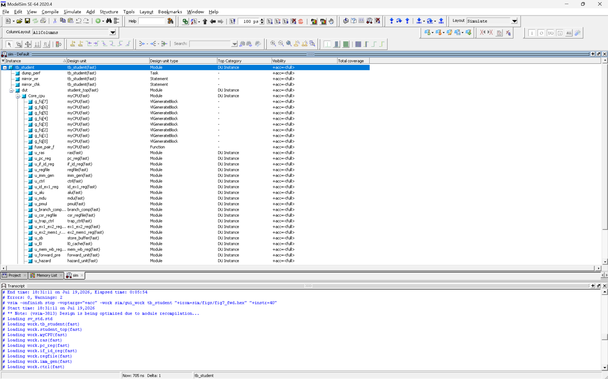

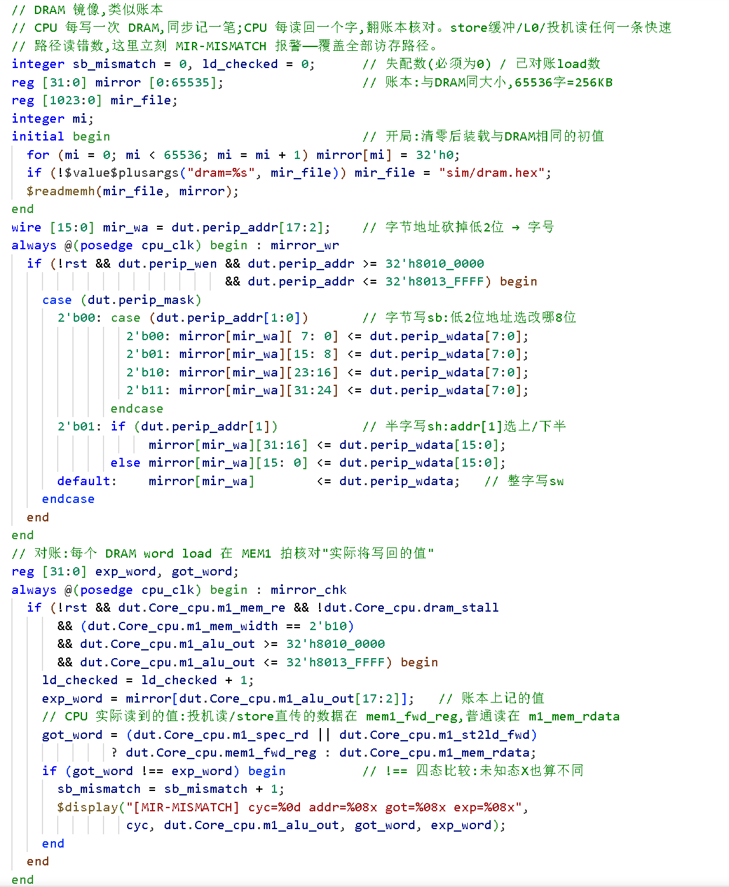

---

## 验证体系

| 层次 | 手段 | 结果 |
|------|------|------|
| 指令集 | riscv-tests rv32ui + rv32um | 适用 45 例全部通过 |
| 访存 | tb 内置 DRAM 镜像逐 load 比对 | 零失配 |
| 改动无损 | 逐周期一致性回归 | 4 程序 × 32 检查点逐位相同 |
| 网表质量 | 综合/实现检查 | 190MHz 零违例 |
| 优化有效 | dim=10/20/40 三点拟合 | 周期数下降方可合入 |

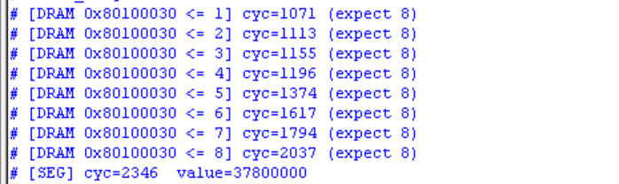

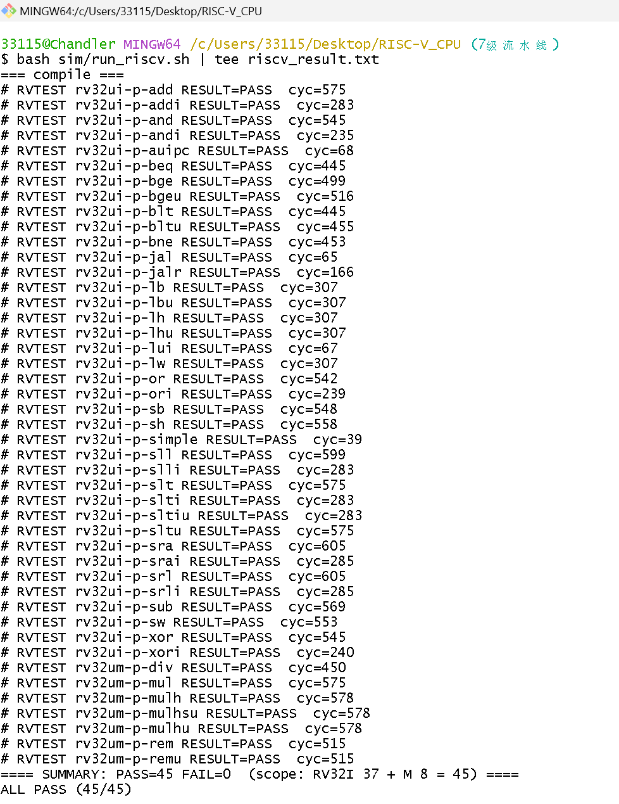

---

## 仿真波形

### 多级转发（图8）

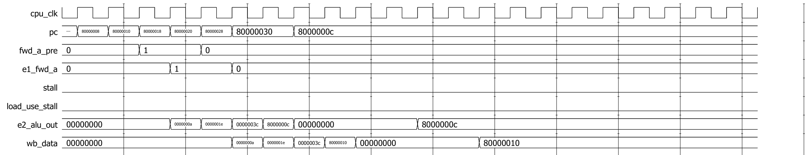

### Load-Use 停顿（图9）

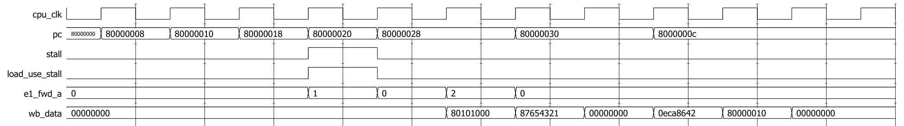

### 宏操作融合（图10）

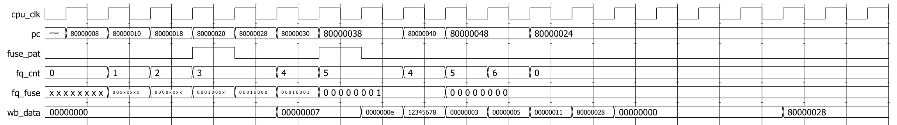

### 深循环分支预测（图11）

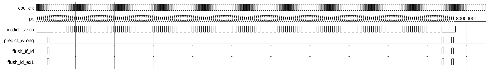

### Load 地址预测（图12）

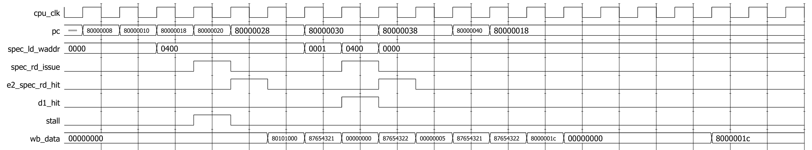

---

## 性能数据

### 矩阵乘法规模拟合（dim=10/20/40）

| 规模 | 周期数 | 说明 |
|------|--------|------|
| dim=10 | 842,981 | 融合后实测（融合前 964,020，−12.56%） |
| dim=20 | 6,913,260 | 融合前实测 |
| dim=40 | 51,954,400 | 融合前实测 |
| dim=80 | ≈3.49 亿 | 平台实测 1294ms@270MHz，与三点拟合一致 |

### 停顿构成（500 万指令窗口，dim=10）

| 统计项 | 数值 | 占比 |
|--------|------|------|
| 总周期 | 5,000,006 | — |
| 真实退休指令 | 4,637,771 | CPI = 1.078 |
| Load-Use 停顿 | 353,066 | 丢失周期的 97.5% |
| 乘除停顿 | 698 | <0.02% |
| DRAM 等待 | 6 | ≈0 |
| 误预测损失 | 8,465（2,111 次 × 4.0 拍） | 0.17% |

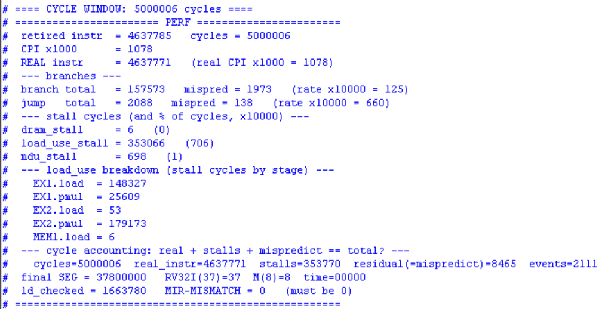

### 频率档位（同一 RTL，仅差 PLL 配置）

| 频点 | 相对基准 | 矩阵乘法用时 |
|------|----------|-------------|
| 270MHz | +42% | 1294ms |
| 260MHz | +37% | 1346ms |
| 250MHz | +32% | 1400ms |
| 230MHz | +21% | 1521ms |
| 210MHz | +11% | 1664ms |
| **190MHz** | **基准（零违例）** | **1842ms** |
| 150MHz | — | 2330ms |
| 100MHz | — | 3495ms |

**各频点平台实测（190MHz 基准 / 230MHz / 250MHz / 260MHz）：**

| 190MHz | 230MHz |
|--------|--------|
|  |  |

| 250MHz | 260MHz |
|--------|--------|
| 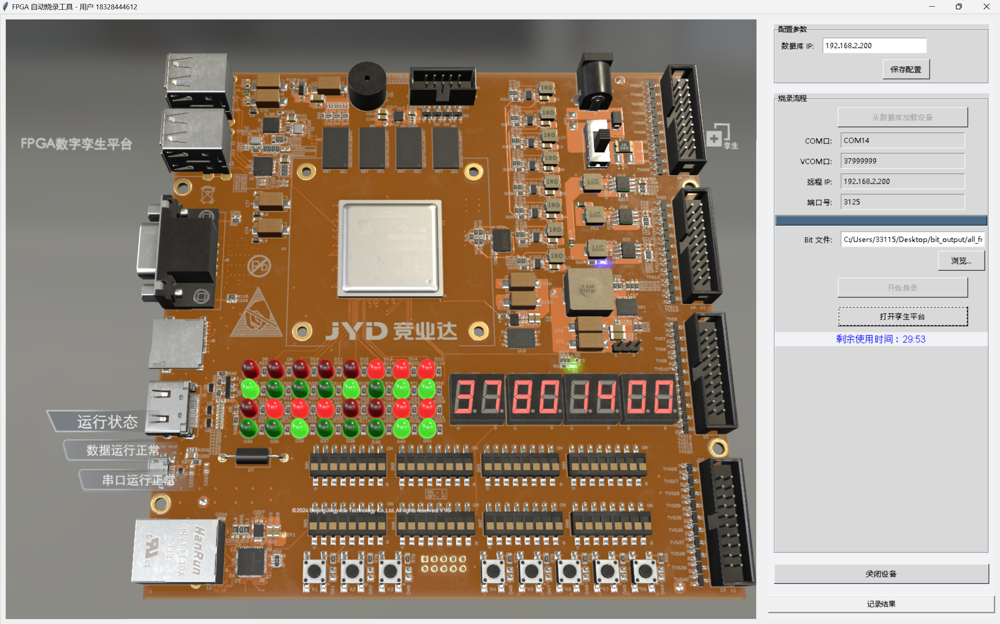 |  |

---

## 参考文献

1. RISC-V International. *The RISC-V Instruction Set Manual, Volume I: Unprivileged ISA*, Version 20191213. 2019.
2. Patterson D A, Hennessy J L. *Computer Organization and Design: RISC-V Edition*. Morgan Kaufmann, 2017.
3. 高亚军. *AMD FPGA设计优化宝典：面向Vivado/SystemVerilog*. 电子工业出版社, 2023.
4. Xilinx Inc. *7 Series FPGAs Memory Resources User Guide* (UG473). 2019.
5. Xilinx Inc. *Vivado Design Suite User Guide: Synthesis* (UG901). 2023.

---

## 许可证

本项目为学术竞赛作品，RTL 代码开源供学习参考。
